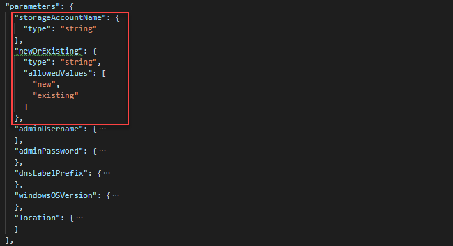
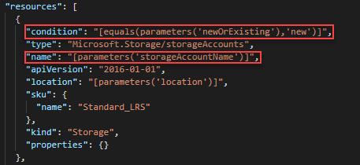

---
title: Use condition in Azure Resource Manager templates | Microsoft Docs
description: Learn how to deploy Azure resources based on conditions.
services: azure-resource-manager
documentationcenter: ''
author: mumian
manager: dougeby
editor: tysonn

ms.service: azure-resource-manager
ms.workload: multiple
ms.tgt_pltfrm: na
ms.devlang: na
ms.date: 10/18/2018
ms.topic: tutorial
ms.author: jgao
---

# Tutorial: Use condition in Azure Resource Manager templates

Learn how to deploy Azure resources based on conditions. 

The scenario used in this tutorial is similar to the one used in [Tutorial: create Azure Resource Manager templates with dependent resources](./resource-manager-tutorial-create-templates-with-dependent-resources.md). In that tutorial, you create a virtual machine, a virtual network, and some other dependent resources including a storage account. Instead of creating a new storage account every time, you let people choose between creating a new storage account and using an existing storage account. To accomplish this goal, you define an additional parameter. If the value of the parameter is "new", a new storage account is created.

This tutorial covers the following tasks:

> [!div class="checklist"]
> * Open a quickstart template
> * Modify the template
> * Deploy the template
> * Clean up resources

If you don't have an Azure subscription, [create a free account](https://azure.microsoft.com/free/) before you begin.

## Prerequisites

To complete this article, you need:

* [Visual Studio Code](https://code.visualstudio.com/) with [Resource Manager Tools extension](./resource-manager-quickstart-create-templates-use-visual-studio-code.md#prerequisites)

## Open a Quickstart template

Azure QuickStart Templates is a repository for Resource Manager templates. Instead of creating a template from scratch, you can find a sample template and customize it. The template used in this tutorial is called [Deploy a simple Windows VM](https://azure.microsoft.com/resources/templates/101-vm-simple-windows/).

1. From Visual Studio Code, select **File**>**Open File**.
2. In **File name**, paste the following URL:

    ```url
    https://raw.githubusercontent.com/Azure/azure-quickstart-templates/master/101-vm-simple-windows/azuredeploy.json
    ```
3. Select **Open** to open the file.
4. Select **File**>**Save As** to save a copy of the file to your local computer with the name **azuredeploy.json**.

## Modify the template

Make two changes to the existing template:

* Add a storage account name parameter. Users can specify either a new storage account name or an existing storage account name.
* Add a new parameter called **newOrExisting**. The deployment uses this parameter to determine where to create a new storage account or use an existing storage account.

1. Open **azuredeploy.json** in Visual Studio Code.
2. Replace **variables('storageAccountName')** with **parameters('storageAccountName')** in the whole template.  There are three appearances of **variables('storageAccountName')**.
3. Remove the following variable definition:

    ```json
    "storageAccountName": "[concat(uniquestring(resourceGroup().id), 'sawinvm')]",
    ```
4. Add the following two parameters to the template:

    ```json
    "storageAccountName": {
      "type": "string"
    },    
    "newOrExisting": {
      "type": "string", 
      "allowedValues": [
        "new", 
        "existing"
      ]
    },
    ```
    The updated parameters definition looks like:

    

5. Add the following line to the beginning of the storage account definition.

    ```json
    "condition": "[equals(parameters('newOrExisting'),'new')]",
    ```

    The condition checks the value of a parameter called **newOrExisting**. If the parameter value is **new**, the deployment creates the storage account.

    The updated storage account definition looks like:

    
6. Add the API version to the following line:

    ```json
    "storageUri": "[reference(resourceId('Microsoft.Storage/storageAccounts/', parameters('storageAccountName')), '2016-01-01').primaryEndpoints.blob]"
    ```

    The API version is required when the resource is not provisioned within same template. The use existing option fails if you don't have the API version specified.
7. Save the changes.

## Deploy the template

Follow the instructions in [Deploy the template](./resource-manager-tutorial-create-templates-with-dependent-resources.md#deploy-the-template) to deploy the template.

When you deploy the template using Azure PowerShell, you need to specify one additional parameter:

```powershell
$resourceGroupName = Read-Host -Prompt "Enter the resource group name"
$storageAccountName = Read-Host -Prompt "Enter the storage account name"
$newOrExisting = Read-Host -Prompt "Create new or use existing (Enter new or existing)"
$location = Read-Host -Prompt "Enter the Azure location (i.e. centralus)"
$vmAdmin = Read-Host -Prompt "Enter the admin username"
$vmPassword = Read-Host -Prompt "Enter the admin password"
$dnsLabelPrefix = Read-Host -Prompt "Enter the DNS Label prefix"

New-AzureRmResourceGroup -Name $resourceGroupName -Location $location
$vmPW = ConvertTo-SecureString -String $vmPassword -AsPlainText -Force
New-AzureRmResourceGroupDeployment -Name mydeployment1018 -ResourceGroupName $resourceGroupName `
    -adminUsername $vmAdmin -adminPassword $vmPW `
    -dnsLabelPrefix $dnsLabelPrefix -storageAccountName $storageAccountName -newOrExisting $newOrExisting `
    -TemplateFile azuredeploy.json
```

> [!NOTE]
> The deployment fails if **newOrExisting** is **new**, but the storage account with the storage account name specified already exists.

Try making another deployment with **newOrExisting** set to "existing" and specify an exiting storage account. To create a storage account beforehand, see [Create a storage account](../storage/common/storage-quickstart-create-account.md).

## Clean up resources

When the Azure resources are no longer needed, clean up the resources you deployed by deleting the resource group.

1. From the Azure portal, select **Resource group** from the left menu.
2. Enter the resource group name in the **Filter by name** field.
3. Select the resource group name.  You shall see a total of six resources in the resource group.
4. Select **Delete resource group** from the top menu.

## Next steps

In this tutorial, you develop a template that allows users to choose between creating a new storage account and using an existing storage account. The virtual machine created in this tutorial requires an administrator username and password. Instead of passing the password during the deployment, you can pre-store the password using Azure Key Vault, and retrieve the password during the deployment. To learn how to retrieve secrets from Azure Key Vault, and use the secrets in the template deployment, see:

> [!div class="nextstepaction"]
> [Integrate Key Vault in template deployment](./resource-manager-tutorial-use-key-vault.md)
