# Tutorial: Transform data with Azure Data Box Edge (Preview)

This tutorial describes how to configure compute role on the Data Box Edge. Once the compute role is configured, Data Box Edge can transform data before sending to Azure.

This procedure can take around 30-45 minutes to complete. 

In this tutorial, you learn how to:

> [!div class="checklist"]
> * Create an IoT Hub resource
> * Set up compute role
> * Add a compute module
> * Verify data transform and transfer

> [!IMPORTANT]
> Data Box Edge is in preview. Review the [Azure terms of service for preview](https://azure.microsoft.com/support/legal/preview-supplemental-terms/) before you order and deploy this solution. 
 
## Prerequisites

Before you set up compute on your Data Box Edge, make sure that:

* Your Data Box Edge device is activated as detailed in [Connect and activate your Azure Data Box Edge](data-box-edge-deploy-connect-setup-activate.md).


## Create an IoT Hub resource

Before you set up compute role on Data Box Edge, you must create an IoT Hub resource.

For detailed instructions, go to [Create an IoT Hub](https://docs.microsoft.com/azure/iot-hub/iot-hub-create-through-portal#create-an-iot-hub). Use the same subscription and the resource group that you used for your Data Box Edge resource.

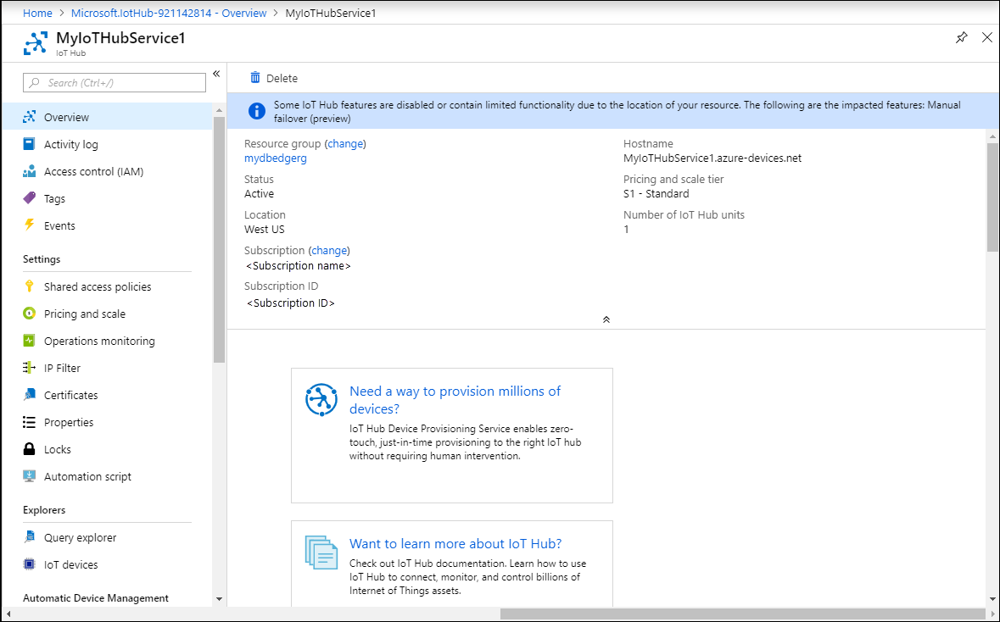

When the Edge compute role isn't set up, note:

- The IoT Hub resource doesn't have any IoT devices or IoT Edge devices.
- You can't create Edge local shares. When you add a share, the option to create a local share for Edge compute isn't enabled.


## Set up compute role

When the Edge compute role is set up on the Edge device, it creates two devices – one is an IoT device and the other is IoT Edge device. Both of these devices can be viewed in the IoT Hub resource.

To set up the compute role on the device, do the following steps.

1. Go to the Data Box Edge resource and then go to **Overview** and click **Set up compute role**. 

    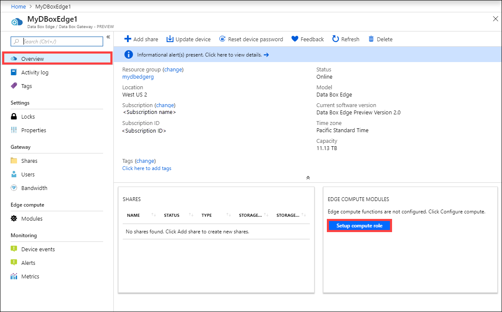
   
    You can also go to **Modules** and click **Configure compute**.

    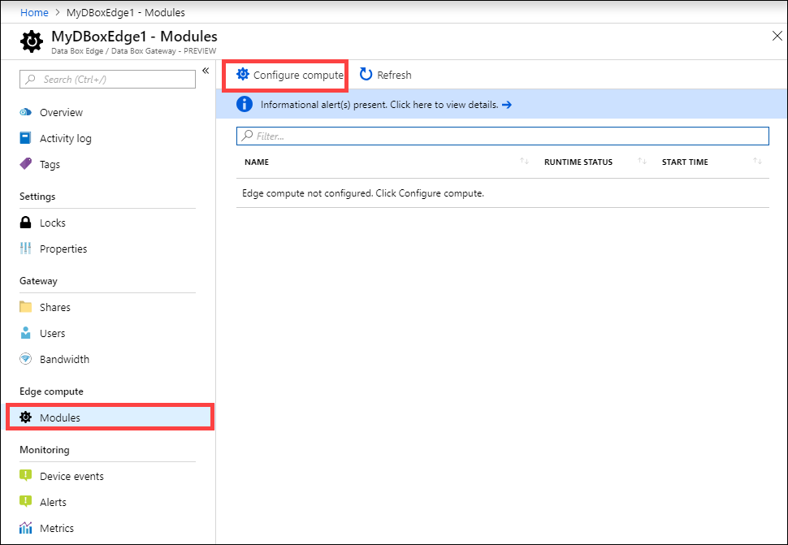
 
2. From the dropdown list, select the **IoT Hub resource** you created in the previous step. Only the Linux platform is available at this point for your IoT Edge device. Click **Create**.

    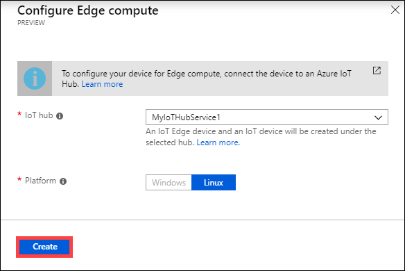
 
3. The compute role takes a couple minutes to create. Because of a bug in this release, even when the compute role is created, the screen doesn't refresh. Go to **Modules** and you can see that the Edge compute is configured.  

    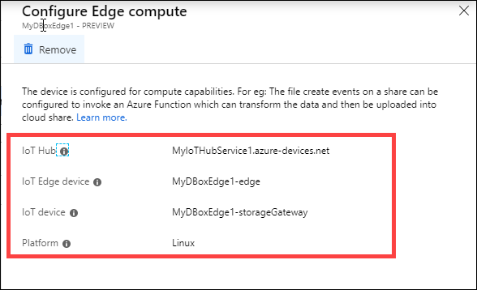

4. Go to **Overview** again and now the screen is updated to indicate that the compute role is configured.

    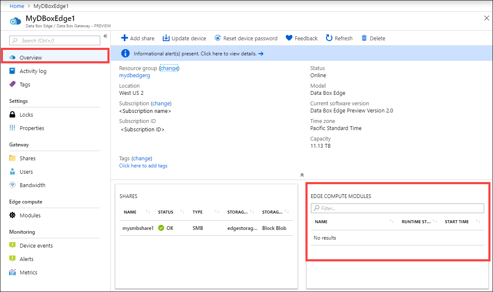
 
5. Go to the IoT Hub you used when creating the Edge compute role. Go to **IoT devices**. You can see that an IoT device is now enabled. 

    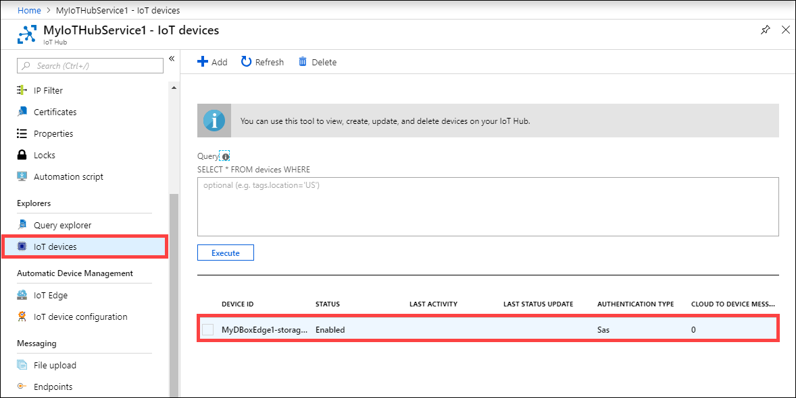

6. Go to **IoT Edge** and you'll see that an IoT Edge device is also enabled.

    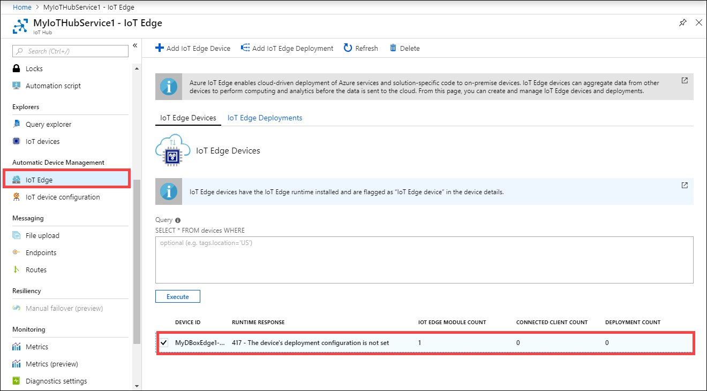
 
7. Select and click the IoT Edge device. An Edge agent is running on this IoT Edge device. 

    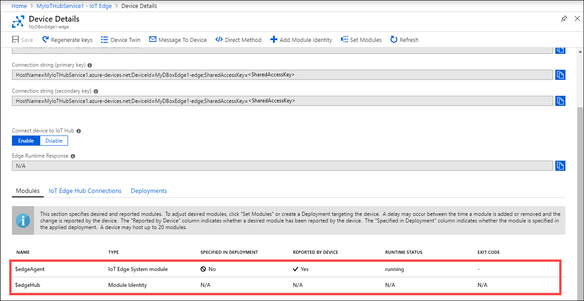 

There are however no custom modules on this Edge device. You can now add a custom module to this device. To learn how to create a custom module, go to [Develop a C# module for your Data Box Edge](data-box-edge-create-iot-edge-module.md).


## Add a custom module

In this section, you'll add a custom module to the IoT Edge device that you created in [Develop a C# module for your Data Box Edge](data-box-edge-create-iot-edge-module.md). 

This procedure uses an example where the custom module used takes files from a local share on the Edge device and moves those to a cloud share on the device. The cloud share then pushes the files to the Azure storage account associated with the cloud share. 

1. The first step is to add a local share on the Edge device. In your Data Box Edge resource, go to **Shares**. Click **+ Add share**. Provide the share name and select the share type. To create a local share, check the **Configure as Edge local share** option. Select an **existing user** or **create new**. Click **Create**.

    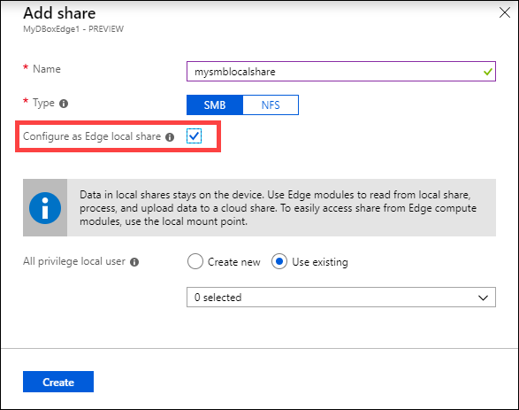 

    If you created a local NFS share, use the following rsync command option to copy files onto the share:

    `rsync --inplace <source file path> < destination file path>`

     For more information on the rsync command, go to [Rsync documentation](https://www.computerhope.com/unix/rsync.htm). 

 
2. Once the local share is created and you've received a successful creation notification (share list may be updated before but you must wait for the share creation to complete), go to the list of shares. 

    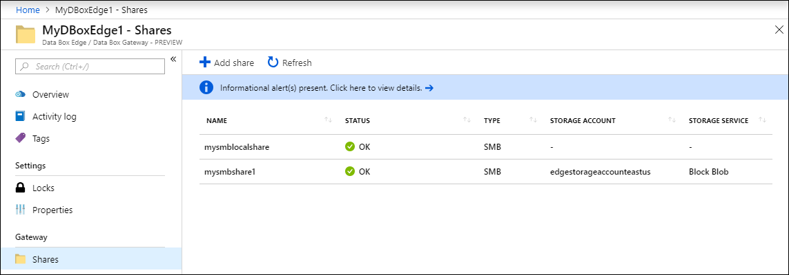 
 
3. Select and click the newly created local share and view the properties of the share. Copy and save the **local mount point for Edge modules** corresponding to this share.

    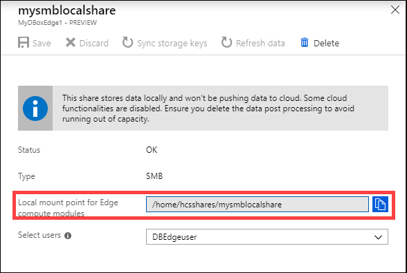 
 
    Go to an existing cloud share created on your Data Box Edge device. Again, copy and save the local mountpoint for Edge compute modules for this cloud share. These local mountpoints will be used when deploying the module.

    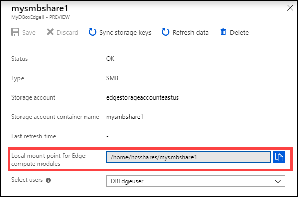  

4. To add a custom module to the IoT Edge device, go to your IoT Hub resource and then go to **IoT Edge device**. Select and click the device. In the **Device details**, from the command bar at the top, click **Set Modules**. 

     

5. Under **Add Modules**, do the following steps:

    1. Provide the **name**, **address**, **user name**, and **password** for the **Container registry settings** for the custom module. The name, address and listed credentials are used to retrieve modules with a matching URL. To deploy this module, under **Deployment modules**, select **IoT Edge module**. This IoT Edge module is a docker container you can deploy to IoT Edge device associated with your Data Box Edge device.

        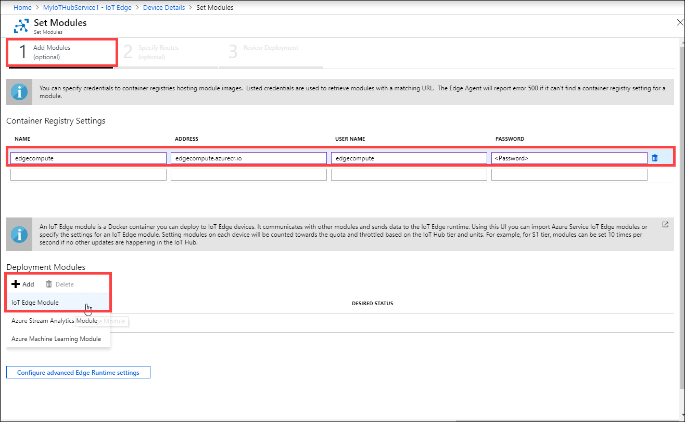 
 
    2. Specify the settings for the IoT Edge custom module. Provide the **name** of your module and **image URI** for the corresponding container image. 
    
        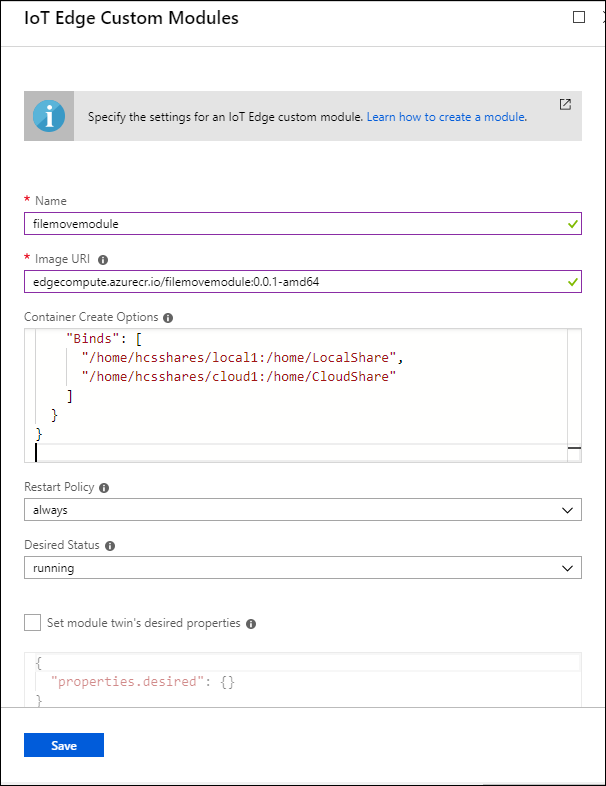 

    3. In the **Container create options**, provide the local mountpoints for the Edge modules copied in the preceding steps for the cloud and local share (important to use these paths as opposed to creating new ones). These shares are mapped to the corresponding container mount points. 
    
        In this case, the paths specified in `Binds` are:
        
        ```
        /home/hcsshares/mysmblocalshare:/home/LocalShare
        /home/hcsshares/mysmbshare1:/home/CloudShare
        ```

        Also provide any environmental variables here as well for your module.

        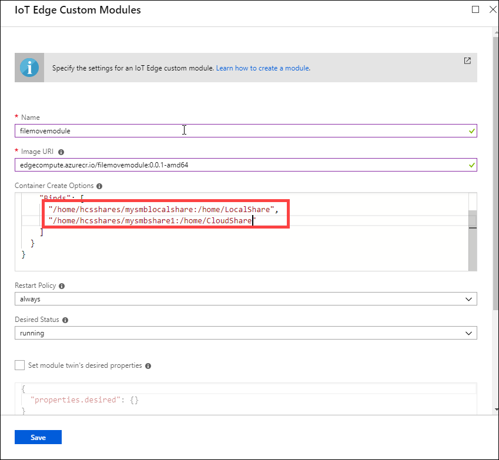 
 
    4. **Configure advanced Edge runtime settings** if needed and then click **Next**.

        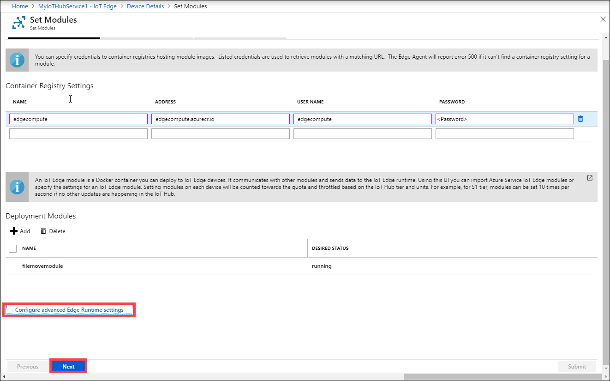 
 
6.	Under **Specify routes**, set routes between modules. In this case, provide the name of the local share that will push data to cloud share. Click **Next**.

     
 
7.	Under **Review deployment**, review all the settings and if satisfied, **submit** the module for deployment.

    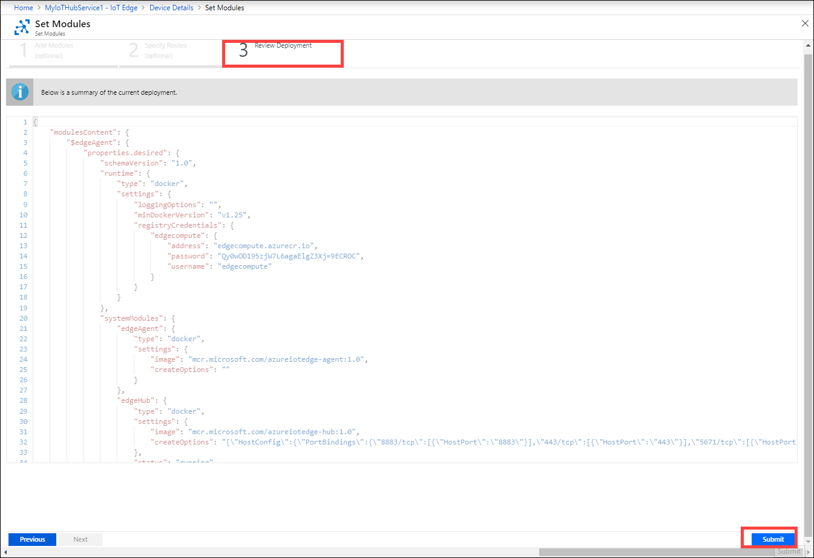 
 
This starts the module deployment as shown by the **IoT Edge Custom module** under **Modules**.

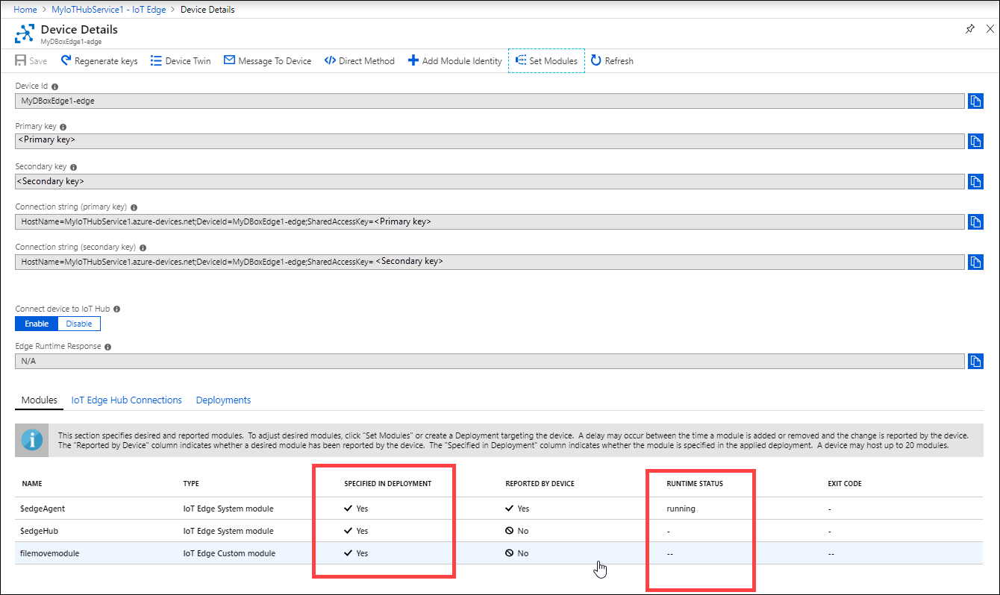 

### Verify data transform and transfer

The final step is to make sure the module is connected and running as expected. Do the following steps to verify that the module is running.

1. The runtime status of module should be running for your IoT Edge device in the IoT Hub resource.

     
 
2. Select and click the module and look at the **Module Identity Twin**. The client status for the Edge device and module should show as **Connected**.

    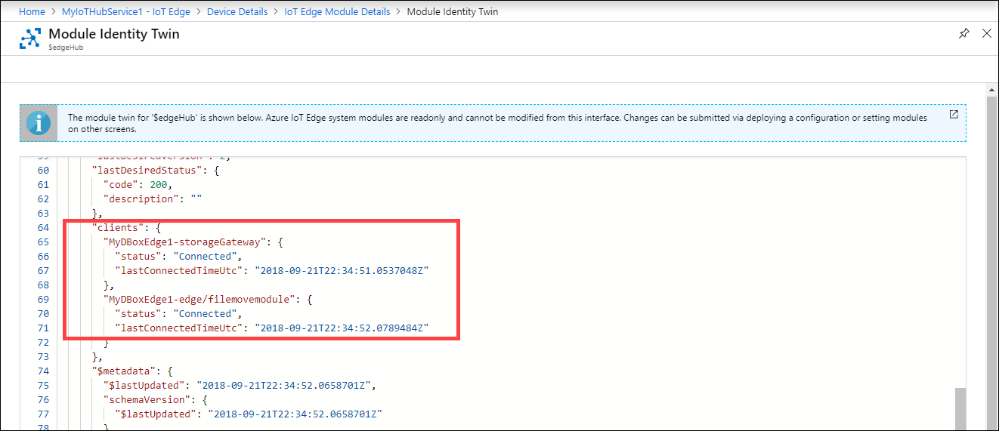 
 
3.	Once the module is running, it is also displayed under the list of Edge modules in your Data Box Edge resource. The **runtime status** of the module you added is **running**.

    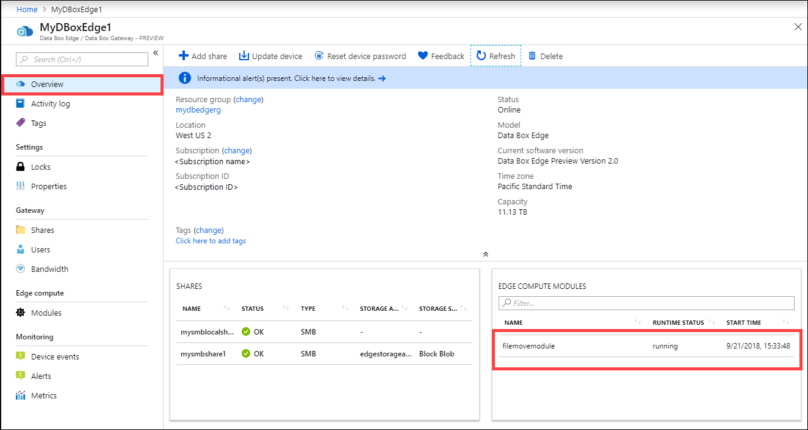 
 
4.	Connect to both the local and cloud shares you created via File Explorer.

    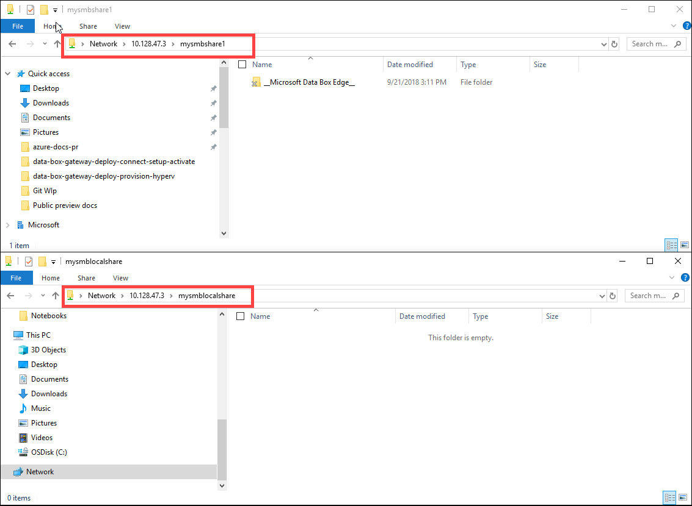 
 
5.	Add data to the local share.

    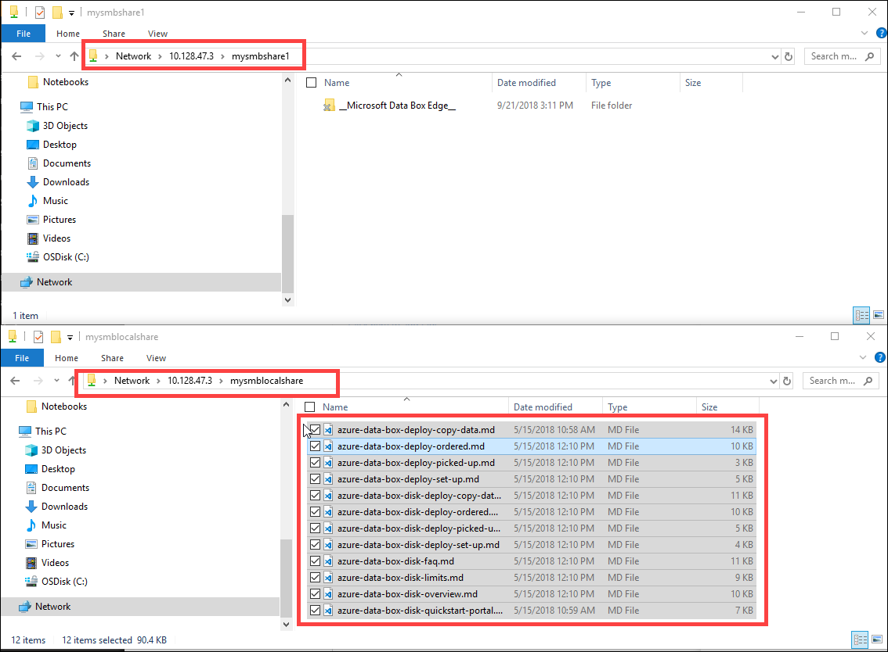 
 
6.	The data gets moved to the cloud share.

    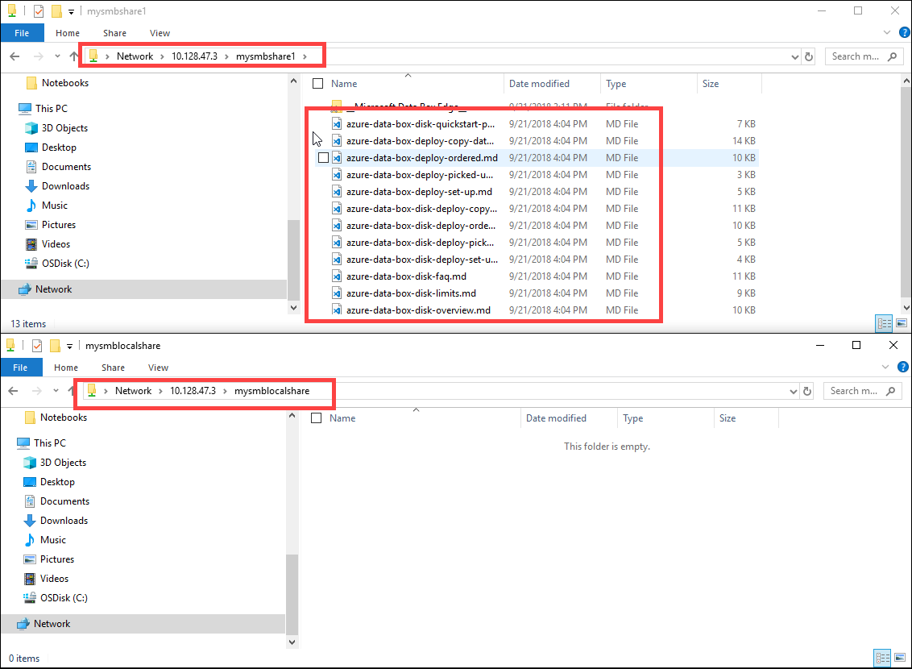  

7.	The data is then pushed from cloud share to the storage account. Go to the Storage Explorer to view the data.

    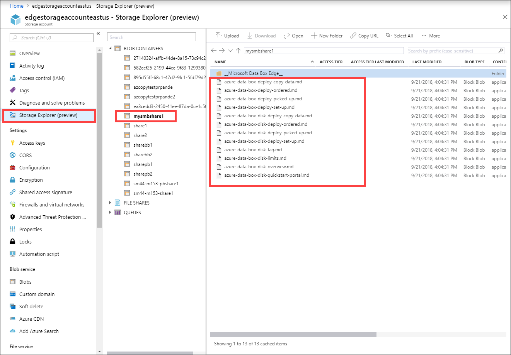 
 
This concludes the validation process.


## Next steps

In this tutorial, you learned about  Data Box Edge topics such as:

> [!div class="checklist"]
> * Create an IoT Hub resource
> * Set up compute role
> * Add a compute module
> * Verify data transform and transfer

Advance to the next tutorial to learn how to administer your Data Box Edge.

> [!div class="nextstepaction"]
> [Use local web UI to administer a Data Box Edge](http://aka.ms/dbg-docs)


